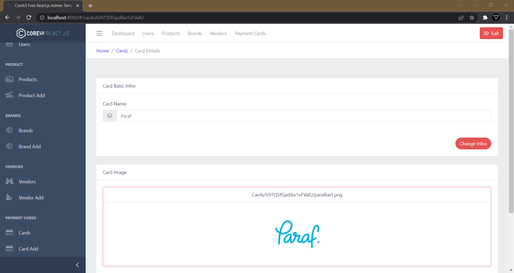
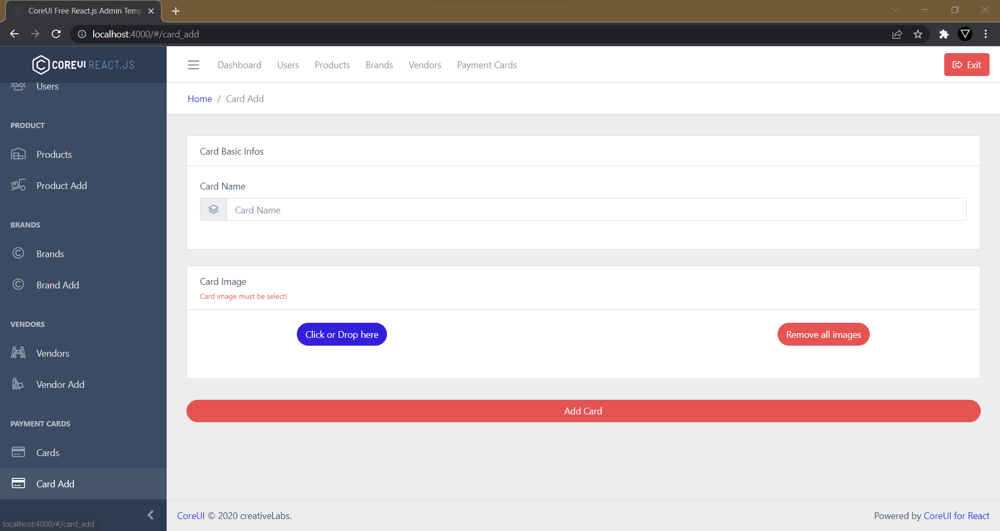

# Firebase Shopping App Admin Panel
Admin panel made with React.js, Express.js and Firebase Admin SDK for 
[Flutter Firebase Shopping App](https://github.com/canersulusoglu/flutter-firebase-shopping-app) repository.

## Settings

***service-account-key.json*** Your firebase admin sdk configurations.

***config.ts*** Firebase Storage and server configurations.

## Commands

> To start application in development mode `npm run startDev`

> To build server `npm run buildServer` 

> To build client `npm run buildClient` 

> To build both server and client `npm run buildAll` 

> To start application in production mode `npm run start` 

## Screenshots

## Used Main Libraries

[CoreUI Free React.js Admin Template](https://coreui.io/react/) - Version: 3.2.1

[Firebase Admin Node.js SDK](https://www.npmjs.com/package/firebase-admin) - Version: 9.11.1
